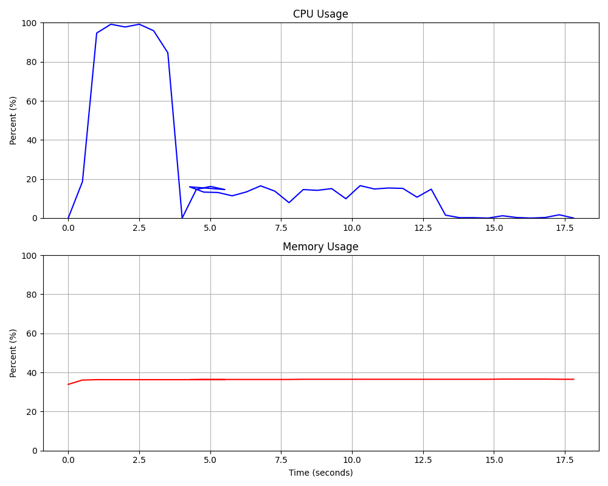
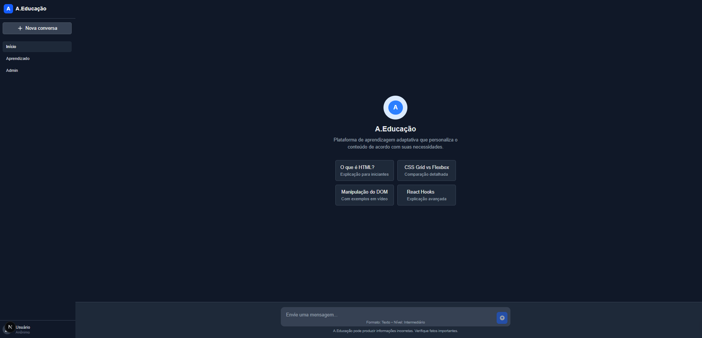

# A.Educação - Sistema de Aprendizagem Adaptativa

## Visão Geral

A.Educação é um sistema de aprendizagem adaptativa que fornece conteúdo personalizado baseado no histórico do usuário, utilizando técnicas avançadas para otimizar a eficácia do aprendizado. O sistema combina diferentes abordagens de Processamento de Linguagem Natural (PLN) para recomendar e customizar uma jornada de aprendizado personalizada para cada usuário.

<p align="center">
  
  <br>
  <em>Métricas de performance do sistema durante testes automatizados</em>
</p>

## Arquitetura do Sistema

O projeto foi construído seguindo princípios de Clean Architecture com clara separação de responsabilidades entre camadas:

### Estrutura de Camadas

1. **Controllers (C)**: Camada externa que gerencia as interações com o usuário através de:
   - Requisições HTTP via API REST (FastAPI)
   - Validação de entradas
   - Coordenação dos fluxos de dados

2. **Application Services (S)**: Camada que implementa a lógica de aplicação:
   - Coordena fluxos entre o domínio e a infraestrutura
   - Implementa casos de uso específicos
   - Mantém a lógica de negócio isolada da implementação técnica

3. **Domain (Dm)**: Núcleo do sistema contendo:
   - Entidades de negócio (Document, UserProgress)
   - Regras de domínio e interfaces (repositories, services)
   - Casos de uso que definem as operações principais

4. **Infrastructure**: Camada que implementa os detalhes técnicos:
   - Persistência de dados (ChromaDB)
   - Serviços externos (OCR, transcrição)
   - Implementações concretas das interfaces de domínio

### Diagrama de Componentes

```
┌─────────────────┐     ┌─────────────────┐     ┌─────────────────┐
│   Controllers   │────▶│   Application   │────▶│     Domain      │
│                 │◀────│    Services     │◀────│                 │
└─────────────────┘     └─────────────────┘     └─────────────────┘
         ▲                      ▲                       ▲
         │                      │                       │
         │                      │                       │
         ▼                      ▼                       ▼
┌─────────────────────────────────────────────────────────────────┐
│                        Infrastructure                           │
└─────────────────────────────────────────────────────────────────┘
```

## Funcionalidades Principais

### 1. Indexação de Conteúdo

O sistema utiliza técnicas avançadas de indexação para extrair informações contextuais significativas de diferentes tipos de conteúdo:

```python
# backend/app/application/services/indexer_service.py
class IndexerService(IndexingService):
    # ...
    def index_text(self, text_path: str) -> bool:
        # Implementação para indexar arquivos de texto
        # ...
        
    def index_pdf(self, pdf_path: str) -> bool:
        # Implementação para indexar PDFs
        # ...
        
    def index_video(self, video_path: str) -> bool:
        # Implementação para indexar vídeos (com transcrição)
        # ...
        
    def index_image(self, image_path: str) -> bool:
        # Implementação para indexar imagens (com OCR)
        # ...
        
    def index_audio(self, audio_path: str) -> bool:
        # Implementação para indexar áudios
        # ...
```

### 2. Busca Semântica

O sistema implementa busca semântica utilizando ChromaDB como base de vetores para encontrar conteúdo relevante:

```python
# backend/app/infrastructure/repositories/chroma_document_repository.py
class ChromaDocumentRepository(DocumentRepository):
    # ...
    def search(self, query: str, limit: int = 5) -> List[Document]:
        """
        Realiza uma busca semântica por documentos relevantes.
        """
        try:
            # Realiza a busca no ChromaDB
            results = self.collection.query(
                query_texts=[query],
                n_results=limit
            )
            
            # Converte os resultados para objetos Document
            documents = []
            for i, doc_id in enumerate(results["ids"][0]):
                # Obtém metadados e conteúdo
                metadata = results["metadatas"][0][i] if results["metadatas"] else {}
                content = results["documents"][0][i] if results["documents"] else ""
                
                # Obtém o tipo de documento
                doc_type_str = metadata.get("doc_type", "TEXT")
                doc_type = DocumentType(doc_type_str.lower())
                
                # Cria o objeto Document
                document = Document(
                    id=doc_id,
                    content=content,
                    doc_type=doc_type,
                    metadata=metadata
                )
                documents.append(document)
                
            return documents
        except Exception as e:
            print(f"Erro ao buscar documentos: {e}")
            return []
```

### 3. Geração de Respostas Adaptativas

O sistema utiliza PLN e Machine Learning para gerar respostas personalizadas baseadas no perfil do usuário:

```python
# backend/app/domain/usecases/generate_adaptive_response_usecase.py
class GenerateAdaptiveResponseUseCase:
    def __init__(self, prompt_service: PromptService, neural_service=None):
        self.prompt_service = prompt_service
        self.neural_service = neural_service
        
    def generate_response(
        self, 
        query: str, 
        user_level: str = "intermediário", 
        preferred_format: str = "texto",
        user_id: Optional[str] = None
    ) -> str:
        """
        Gera uma resposta adaptativa com base na consulta e no perfil do usuário.
        """
        # Utiliza o serviço neural se disponível
        if self.neural_service and user_id:
            try:
                # Tenta gerar uma resposta aprimorada com rede neural
                return self.prompt_service.generate_response(
                    query=query,
                    user_level=user_level,
                    preferred_format=preferred_format,
                    user_id=user_id
                )
            except Exception as e:
                print(f"Erro ao usar serviço neural: {e}")
                # Em caso de erro, recorre à geração padrão
        
        # Geração de resposta padrão
        return self.prompt_service.generate_response(
            query=query,
            user_level=user_level,
            preferred_format=preferred_format,
            user_id=user_id
        )
```

### 4. Feedback do Usuário

O sistema coleta e processa feedback do usuário para melhorar continuamente as recomendações:

<p align="center">
  
  <br>
  <em>Interface de feedback para aprimoramento contínuo</em>
</p>

```python
# backend/app/application/controllers/api_controller.py
@app.post("/api/feedback")
def receive_feedback(request: FeedbackRequest):
    try:
        if not request.user_id or not request.query_id or not request.feedback:
            raise HTTPException(
                status_code=400, 
                detail="Campos obrigatórios: user_id, query_id e feedback"
            )
            
        # Salva o feedback no repositório
        success = self.user_progress_repository.update_interaction(
            user_id=request.user_id,
            query="",  # Não temos a consulta original, apenas o ID dela
            response="",  # Não temos a resposta original, apenas o feedback
            feedback=request.feedback
        )
        
        # Se o serviço neural estiver disponível, treina o modelo com o feedback
        neural_updated = False
        if self.neural_network_service:
            try:
                # Treina o modelo com base nos feedbacks acumulados
                loss = self.neural_network_service.train_from_feedback(request.user_id)
                neural_updated = True
            except Exception as e:
                print(f"Erro ao treinar modelo neural com feedback: {e}")
        
        # Retorna sucesso
        return {
            "success": success,
            "neural_updated": neural_updated
        }
```

### 5. Análise de Lacunas de Aprendizado (Learning Gaps)

O sistema identifica lacunas de conhecimento e gera planos de melhoria personalizados:

```python
# backend/app/application/controllers/learning_gaps_controller.py
@self.router.get(
    "/analysis/{user_id}", 
    response_model=GapAnalysisResponse,
    summary="Analisa lacunas de conhecimento do usuário",
    description="Analisa o histórico de interações do usuário para identificar lacunas de conhecimento, pontos fortes e fracos"
)
async def analyze_learning_gaps(user_id: str):
    try:
        if not user_id:
            raise HTTPException(status_code=400, detail="ID de usuário é obrigatório")
        
        analysis = self.gap_analyzer.analyze_progress(user_id)
        
        if not analysis.get("identified_gaps") and not analysis.get("strengths"):
            gap_topics = self._find_gap_topics_in_resources(user_id)
            if gap_topics:
                analysis["identified_gaps"] = gap_topics
        
        return analysis
    
    except Exception as e:
        raise HTTPException(
            status_code=500, 
            detail=f"Erro ao analisar lacunas de conhecimento: {str(e)}"
        )
```

## Tecnologias Utilizadas

### Backend

1. **FastAPI**: Framework web assíncrono para construção de APIs
   - Alta performance com suporte a async/await
   - Validação automática com Pydantic
   - Documentação automática (OpenAPI)

2. **ChromaDB**: Banco de dados vetorial para busca semântica
   - Armazenamento eficiente de embeddings
   - Busca por similaridade semântica
   - Persistência de dados

3. **PyTorch**: Framework para implementação da rede neural
   - Utilizado na implementação do modelo de personalização
   - Processamento de feedback do usuário
   - Ordenação inteligente de resultados

4. **Serviços de Processamento**:
   - **Whisper**: Transcrição de áudio/vídeo
   - **Tesseract OCR**: Extração de texto de imagens

### Frontend

1. **Next.js**: Framework React para aplicações web
   - Renderização do lado do servidor (SSR)
   - Roteamento eficiente
   - Otimização de performance

2. **TypeScript**: Linguagem tipada para desenvolvimento frontend
   - Maior segurança no desenvolvimento
   - Melhor experiência de desenvolvimento com autocompletar

3. **Componentes Interativos**:
   - Formulários adaptativos
   - Visualizadores de mídia (vídeo, áudio, imagens)
   - Interface de feedback

<p align="center">
  
  <br>
  <em>Interface web do sistema A.Educação</em>
</p>

## Mini Rede Neural

O sistema implementa uma rede neural simples para personalização de conteúdo:

```python
# backend/app/application/services/neural_network_service.py
class SimpleNeuralNetwork(nn.Module):
    """Rede neural simples para personalização de conteúdo."""
    
    def __init__(self, input_size, hidden_size, output_size):
        super(SimpleNeuralNetwork, self).__init__()
        self.layer1 = nn.Linear(input_size, hidden_size)
        self.layer2 = nn.Linear(hidden_size, output_size)
    
    def forward(self, x):
        x = torch.relu(self.layer1(x))
        x = self.layer2(x)
        return x
```

### Funcionamento da Rede Neural

1. **Entrada**: Vetores de texto convertidos em tensores
2. **Processamento**:
   - Camada intermediária com função de ativação ReLU
   - Camada de saída para pontuação de relevância
3. **Treinamento**:
   - Baseado no feedback do usuário
   - Atualização de pesos para melhorar recomendações

```python
def train_from_feedback(self, user_id: str) -> float:
    """
    Treina o modelo com base nos feedbacks do usuário.
    
    Args:
        user_id: ID do usuário
        
    Returns:
        Valor da função de perda após o treinamento
    """
    # Obtém ou cria o modelo do usuário
    model = self.get_or_create_user_model(user_id)
    
    # Obtém o progresso do usuário
    user_progress = self.user_progress_repository.get_by_id(user_id)
    if not user_progress or not user_progress.interactions:
        return 0.0
    
    # Filtra interações com feedback
    interactions_with_feedback = [
        interaction for interaction in user_progress.interactions
        if interaction.feedback
    ]
    
    if not interactions_with_feedback:
        return 0.0
    
    # Prepara os dados de treinamento
    inputs = []
    targets = []
    
    for interaction in interactions_with_feedback:
        # Converte o texto para vetor
        input_vector = self._text_to_vector(interaction.query + " " + interaction.response)
        
        # Converte o feedback para valor numérico
        target_value = self._feedback_to_value(interaction.feedback)
        
        inputs.append(input_vector)
        targets.append(target_value)
    
    # Converte listas para tensores
    X = torch.stack(inputs)
    y = torch.tensor(targets, dtype=torch.float32).view(-1, 1)
    
    # Configura otimizador e função de perda
    optimizer = torch.optim.Adam(model.parameters(), lr=self.learning_rate)
    criterion = nn.MSELoss()
    
    # Treina o modelo
    model.train()
    optimizer.zero_grad()
    
    # Forward pass
    outputs = model(X)
    loss = criterion(outputs, y)
    
    # Backward pass e otimização
    loss.backward()
    optimizer.step()
    
    # Salva o modelo atualizado
    self.models[user_id] = model
    
    return loss.item()
```

## Recursos e Armazenamento

### Estrutura de Armazenamento

1. **ChromaDB**: Armazena embeddings e metadados para busca semântica
2. **JSON**: Armazena progresso do usuário e configurações
3. **Sistema de Arquivos**: Armazena recursos estáticos (vídeos, imagens, PDFs)

### Possíveis Melhorias Futuras

1. **Integração com Serviços em Nuvem**:
   - **Amazon S3**: Armazenamento escalável para recursos multimídia
   - **AWS Lambda**: Processamento assíncrono de indexação
   - **Amazon Comprehend**: Análise avançada de sentimentos em feedback

2. **Escalabilidade**:
   - Implementação de arquitetura de microserviços
   - Containerização com Docker e orquestração com Kubernetes
   - Cache distribuído para melhorar performance

3. **Aprimoramentos da IA**:
   - Modelos de linguagem mais avançados para geração de conteúdo
   - Análise multimodal (texto, imagem, áudio) para melhor compreensão
   - Implementação de técnicas de aprendizado por reforço

4. **Monitoramento e Analytics**:
   - Dashboard avançado para análise de uso
   - Métricas de eficácia de aprendizado
   - A/B testing para otimização de conteúdo

## Testes e Performance

O sistema inclui testes automatizados para garantir qualidade e performance:

```python
# backend/tests/performance/stress_test.py
def test_api_response_time(base_url="http://localhost:8000", num_queries=10):
    """
    Testa o tempo de resposta da API sob carga.
    """
    results = {
        "num_queries": num_queries,
        "response_times": [],
        "avg_response_time": 0,
        "min_response_time": 0,
        "max_response_time": 0,
        "errors": 0
    }
    
    # Gera consultas aleatórias
    queries = [
        f"Como funciona {random.choice(['HTML', 'CSS', 'JavaScript', 'React', 'Python'])} {i}?"
        for i in range(num_queries)
    ]
    
    # Executa as consultas
    for query in queries:
        try:
            start_time = time.time()
            
            # Faz a requisição para a API
            response = requests.post(
                f"{base_url}/api/analyze",
                json={
                    "query": query,
                    "user_level": "intermediário",
                    "preferred_format": "texto",
                    "user_id": str(uuid.uuid4()),
                    "use_neural_network": False
                }
            )
            
            # Calcula o tempo de resposta
            elapsed_time = time.time() - start_time
            
            # Verifica se a resposta foi bem-sucedida
            if response.status_code == 200:
                results["response_times"].append(elapsed_time)
            else:
                results["errors"] += 1
                
        except Exception as e:
            print(f"Erro ao testar API: {e}")
            results["errors"] += 1
    
    # Calcula estatísticas
    if results["response_times"]:
        results["avg_response_time"] = sum(results["response_times"]) / len(results["response_times"])
        results["min_response_time"] = min(results["response_times"])
        results["max_response_time"] = max(results["response_times"])
    
    return results
```

## Conclusão

O sistema A.Educação representa uma solução completa para aprendizagem adaptativa, combinando técnicas avançadas de processamento de linguagem natural, busca semântica e personalização baseada em feedback do usuário. A arquitetura modular e bem estruturada permite fácil manutenção e extensão, enquanto a interface intuitiva proporciona uma experiência de aprendizado eficaz e personalizada.

## Como Executar

### Backend

```bash
cd backend
pip install -r requirements.txt
uvicorn main:app --reload
```

### Frontend

```bash
cd frontend
npm install
npm run dev
```

## Licença

Este projeto é distribuído sob a licença MIT.
